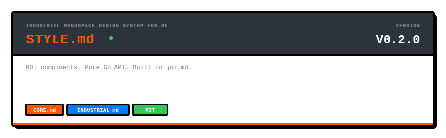
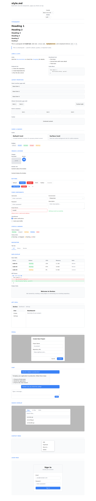
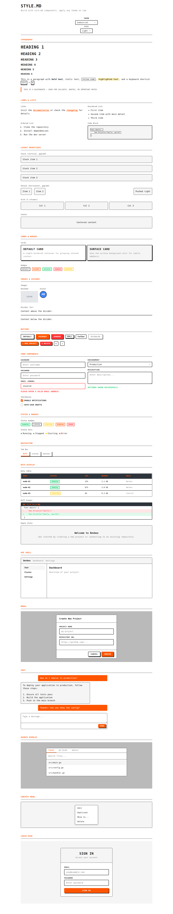

<p align="center">
  
</p>

<p align="center">
  A themeable component library for Go, built on gui.md.
</p>

---

## What is style.md?

**style.md** is a UI component system split into two layers:

1. **[core.md](./core.md)** — Headless components with minimal base styles. Renders semantic HTML with `data-*` attributes for state. No opinions on visual design.
2. **Themes** — CSS-only layers that target the same `data-*` selectors to apply a complete design language. Switch themes by setting `data-theme` on `<html>`.

Current themes:
- **[industrial.md](./themes/industrial.md)** — monospace typography, bold orange accents, hard shadows, high contrast.
- **[devbox.md](./themes/devbox.md)** — Inter typography, green accents, soft shadows, dark-first developer tools aesthetic.

```
┌─────────────────────────────────────────────────┐
│  Your App (Go)                                  │
│    imports core.md components                   │
│    uses data-* attributes for state             │
├─────────────────────────────────────────────────┤
│  core.md/styles.css      │  theme.css            │
│  (minimal defaults)      │  (design layer)       │
│                          │                       │
│  <html>                  │  <html data-theme=    │
│  (base theme)            │    "industrial">      │
└─────────────────────────────────────────────────┘
```

## Quick Start

### Use headless components with base styles

```go
import (
    gui "github.com/readmedotmd/gui.md"
    coremd "github.com/readmedotmd/style.md/core.md"
)

func App() gui.Node {
    return coremd.Stack("lg",
        coremd.Heading(1, "", gui.Text("Dashboard")),
        coremd.Card(coremd.CardProps{},
            coremd.HStack("md",
                coremd.Badge("", coremd.BadgeSuccess, "Running"),
                coremd.Paragraph("", gui.Text("All systems operational.")),
            ),
        ),
        coremd.Button(coremd.ButtonProps{Variant: "primary"}, gui.Text("Deploy")),
    )
}
```

```html
<link rel="stylesheet" href="core.md/styles.css">
```

### Apply a theme

Load the theme CSS and set `data-theme` on `<html>`:

```html
<link rel="stylesheet" href="core.md/styles.css">
<link rel="stylesheet" href="themes/industrial.md/theme.css">
<link rel="stylesheet" href="themes/devbox.md/theme.css">
<html data-theme="industrial">
```

No Go code changes required. The same core.md components render differently based on the active theme.

### Switch themes at runtime

```html
<link rel="stylesheet" href="core.md/styles.css">
<link rel="stylesheet" href="themes/industrial.md/theme.css">
<link rel="stylesheet" href="themes/devbox.md/theme.css">

<select onchange="document.documentElement.setAttribute('data-theme', this.value)">
  <option value="">Base</option>
  <option value="industrial">Industrial</option>
  <option value="devbox">Devbox</option>
</select>
```

You can load all theme CSS files at once — only the one matching `data-theme` activates, since all selectors are scoped under `[data-theme="..."]`.

### Dark mode

Set `data-mode="dark"` on `<html>`, or let themes auto-detect via `prefers-color-scheme`:

```html
<html data-theme="industrial" data-mode="dark">
```

## Packages

### core.md — Headless Components

110+ components with `data-*` attributes and minimal base styles. Includes layout primitives so your UI never needs external CSS.

| Category        | Components |
|-----------------|------------|
| **Primitives**  | Stack, HStack, Grid, Center, Spacer, Card, Badge, Divider, Heading, Paragraph, CodeBlock, InlineCode, Link, Image, UnorderedList, OrderedList, Quote, Muted, Mono, Truncate, SrOnly, MarkdownContent, SectionHeader, Collapsible, Animate, HelpText |
| **Buttons**     | Button (primary, danger, toolbar; medium, small) |
| **Forms**       | FormGroup, TextInput, NumberInput, TextArea, SelectInput, Checkbox, FeatureRow, VariableRow, EditableVariableRow, SchemaField, PasswordField, SecretField, ErrorMessage, SuccessMessage |
| **Input**       | ChatInput, AutocompletePopup, MessageQueue, SearchInputField, PastePreview, MessageQueueBar, QueuedItem, AttachmentButton, ModeToggle |
| **Display**     | MessageBubble, QuestionPrompt, StatusBadge, StatusDot, LabelBadge, UsageBadge, DiffViewer, DataTable, EmptyState, ClusterStatsBar, MessageContent, ActionTag, SystemStats, DiffPanel, StatChip, VariableChip |
| **Lists**       | ConversationItem, InstanceCard, InstanceList, ServiceRow, RunnerRow, FileTree, DevboxCard, EnvironmentCard |
| **Navigation**  | NavLink, TabBar, BottomTabBar |
| **Overlay**     | SearchOverlay, ContextMenu, BottomSheet, SearchResult, SearchResultContent, SearchSnippet |
| **Panels**      | GitPanel, SkillsPanel, TerminalPanel, GitSectionHeader, GitFileList, GitFile, GitCommitArea |
| **Layout**      | AppShell, Navbar, Sidebar, Panel, Modal, ModalBackdrop, DashboardLayout, SidebarColumn, ChatHeader, Box, ScrollArea, SplitLayout, Backdrop, IconButton, ToolbarButton, Toolbar, ResizeHandle |
| **Pages**       | LoginPage, SetupWizard, SettingsCard, SettingsPage, SettingsCardFull, SettingsSection, SettingsSubsection, SettingsForm, SettingsCodeInput, ClusterSummaryCard, ClusterSummaryRow |
| **Utility**     | Spinner, Icon, AppShellFull |

**CSS primitives** in `styles.css` cover typography (h1-h6, p, code, pre, blockquote, kbd, mark), links, lists, images (`data-rounded`, `data-avatar`), layout (`data-stack`, `data-hstack`, `data-grid`, `data-align`, `data-justify`, `data-wrap`, `data-center`, `data-spacer`), cards (`data-card`), badges (`data-badge`), dividers, and utilities (`data-truncate`, `data-muted`, `data-mono`, `data-sr-only`).

### industrial.md — Industrial Monospace Theme

A CSS-only theme layer. Load the CSS and set `data-theme="industrial"` on `<html>`.

- Space Mono typography
- `#FF5500` orange accents
- Hard shadows, 2px borders
- Uppercase headings, labels, and badges
- Square bullet points, thick dividers
- Full dark mode support

### devbox.md — Developer Tools Theme

A CSS-only theme layer. Load the CSS and set `data-theme="devbox"` on `<html>`.

- Inter sans-serif typography
- `#22C55E` green accents
- Soft layered shadows, rounded corners
- Dark-first aesthetic
- Subtle active state indicators
- Full dark mode support

## Data Attributes

Components communicate state through `data-*` attributes, which themes target via CSS:

| Attribute | Values | Used by |
|-----------|--------|---------|
| `data-variant` | `primary`, `danger`, `toolbar` | Button |
| `data-size` | `small`, `large` | Button, Spinner |
| `data-active` | `true` | NavLink, TabBar, ConversationItem |
| `data-status` | `running`, `stopped`, `starting`, `pending`, `error` | StatusBadge, StatusDot |
| `data-error` | `true` | TextInput |
| `data-streaming` | `true` | MessageBubble, ChatInput |
| `data-open` | `true` | Sidebar, SidebarColumn |
| `data-expanded` | `true` | Panel, GitPanel |
| `data-role` | `user`, `assistant` | MessageBubble, MessageContent |
| `data-has-image` | `true` | QueuedItem |
| `data-match` | `true` | SearchSnippet lines |
| `data-danger` | `true` | ContextMenu items, BottomSheet items |
| `data-staged` | `true` | GitSectionHeader, GitFile |
| `data-state` | `M`, `A`, `D`, `??` | GitFile |
| `data-selected` | `true` | AutocompletePopup items, GitFile |
| `data-diff` | `add`, `remove`, `header`, `context` | DiffViewer lines |
| `data-scrollable` | `true` | AppShellFull |
| `data-completed` | `true` | SetupWizard steps |
| `data-stack` | `xs`, `sm`, `md`, `lg`, `xl`, `none` | Stack layout |
| `data-hstack` | `xs`, `sm`, `md`, `lg`, `xl`, `none` | HStack layout |
| `data-grid` | `1`-`6` | Grid layout |
| `data-card` | `true`, `surface`, `flush` | Card |
| `data-badge` | `true`, `accent`, `success`, `danger`, `warning` | Badge |
| `data-align` | `start`, `center`, `end`, `stretch`, `baseline` | Alignment modifier |
| `data-justify` | `start`, `center`, `end`, `between`, `around`, `evenly` | Justification modifier |
| `data-box` | | Box |
| `data-pad` | `xs`, `sm`, `md`, `lg`, `xl` | Box padding |
| `data-bg` | `surface`, `accent`, `muted` | Box background |
| `data-box-border` | `true` | Box border |
| `data-box-flex` | `true` | Box flex display |
| `data-box-rounded` | `true` | Box rounded corners |
| `data-scroll-area` | | ScrollArea |
| `data-split-layout` | | SplitLayout |
| `data-backdrop` | | Backdrop |
| `data-icon-button` | | IconButton |
| `data-toolbar` | | Toolbar |
| `data-rich-text` | | MarkdownContent |
| `data-section-header` | | SectionHeader |
| `data-collapsible` | | Collapsible |
| `data-animate` | `pulse`, `fade-in`, `spin` | Animate |
| `data-form-group` | | FormGroup |
| `data-feature-info` | | FeatureRow info container |
| `data-feature-name` | | FeatureRow name |
| `data-feature-desc` | | FeatureRow description |
| `data-settings-card-header` | | SettingsCard, SettingsCardFull header |
| `data-settings-card-body` | | SettingsCard, SettingsCardFull body |
| `data-editable-var-row` | | EditableVariableRow |
| `data-passthrough` | `true` | EditableVariableRow |
| `data-schema-field` | | SchemaField |
| `data-schema-field-name` | | SchemaField name span |
| `data-schema-field-type` | | SchemaField type span |
| `data-schema-field-desc` | | SchemaField description span |
| `data-header` | | Generic header primitive (SidebarHeader, ChatHeader, GitPanel, GitSectionHeader, SettingsSection, SettingsCardFull, SettingsSubsection) |
| `data-list-item` | | Generic list item primitive (NavLink, ConversationItem, GitFile) |
| `data-side-panel` | | Generic side panel primitive (GitPanel, TerminalPanel) |
| `data-terminal-panel` | | TerminalPanel |
| `data-terminal-tabs` | | TerminalPanel tab bar |
| `data-terminal-tab` | | TerminalPanel individual tab |
| `data-settings-subsection-header` | | SettingsSubsection header |
| `data-settings-subsection-body` | | SettingsSubsection body |
| `data-dir` | `true` | FileTree directory items |
| `data-working` | `true` | InstanceCard |
| `data-password-field` | | PasswordField |
| `data-password-toggle` | | PasswordField toggle button |
| `data-visible` | `true` | PasswordField (visible mode) |
| `data-secret-field` | | SecretField |
| `data-secret-key` | | SecretField key display |
| `data-secret-value` | | SecretField value display |
| `data-secret-scope` | | SecretField scope display |
| `data-secret-copy` | | SecretField copy button |
| `data-secret-remove` | | SecretField remove button |
| `data-env-card` | | EnvironmentCard |
| `data-stat-chip` | | StatChip |
| `data-variable-chip` | | VariableChip |
| `data-help-text` | | HelpText |

## CSS Custom Properties

Themes override these tokens defined in `core.md/styles.css`:

```css
:root {
  --core-font:       system-ui, sans-serif;
  --core-font-mono:  ui-monospace, monospace;
  --core-text:       #1a1a1a;
  --core-text-muted: #6b7280;
  --core-bg:         #ffffff;
  --core-surface:    #f9fafb;
  --core-border:     #d1d5db;
  --core-accent:     #3b82f6;
  --core-danger:     #ef4444;
  --core-success:    #22c55e;
  --core-warning:    #f59e0b;
  --core-info:       #3b82f6;
  --core-radius:     6px;
  --core-space:      8px;
  --core-transition: 150ms ease;

  /* Layout widths */
  --core-width-sidebar:  300px;
  --core-width-panel:    300px;
  --core-width-git-panel: 420px;
  --core-width-modal:    480px;
  --core-width-search:   600px;
  --core-width-message:  680px;
  --core-width-content:  720px;
  --core-width-expanded: 960px;
  --core-width-login:    400px;
}
```

Dark mode activates via `prefers-color-scheme: dark` or `data-mode="dark"` on `<html>`.

## Creating a Theme

A theme is a CSS file that:

1. Scopes all selectors under `[data-theme="yourtheme"]`
2. Overrides `--core-*` custom properties (fonts, colors, spacing)
3. Targets `data-*` attribute selectors to add decorative styles
4. Optionally adds theme-specific tokens

```css
/* mytheme.css */
[data-theme="mytheme"] {
  --core-font: 'Inter', sans-serif;
  --core-accent: #8b5cf6;
  --core-radius: 12px;
}

[data-theme="mytheme"] button[data-variant="primary"] {
  box-shadow: 0 4px 12px color-mix(in srgb, var(--core-accent) 40%, transparent);
}

[data-theme="mytheme"] [data-card] {
  box-shadow: 0 2px 8px rgba(0,0,0,0.08);
}

/* Dark mode */
@media (prefers-color-scheme: dark) {
  [data-theme="mytheme"]:not([data-mode="light"]) {
    --core-bg: #111;
    --core-text: #eee;
  }
}
[data-theme="mytheme"][data-mode="dark"] {
  --core-bg: #111;
  --core-text: #eee;
}
```

## Theme Switcher Demo

The [`examples/theme-switcher.html`](./examples/theme-switcher.html) file provides an interactive showcase with dropdowns to switch between Base, Industrial, and Devbox themes, plus light/dark mode toggle.

<p align="center">
  
  
</p>

## Project Structure

```
style.md/
├── core.md/                   Headless component library (Go)
│   ├── styles.css             Base styles + layout primitives
│   ├── primitives.go          Stack, Grid, Card, Badge, Heading, Link, Image, ...
│   ├── button.go              Button component
│   ├── form.go                Form components
│   ├── layout.go              App shell, navbar, sidebar, modal
│   ├── display.go             Status badges, diff viewer, data table
│   ├── ...                    (14 Go files total)
│   └── examples/showcase.html Core.md showcase
├── themes/
│   ├── industrial.md/         Industrial monospace theme (CSS only)
│   │   ├── theme.css          Scoped under [data-theme="industrial"]
│   │   └── examples/showcase.html Industrial showcase
│   └── devbox.md/             Developer tools theme (CSS only)
│       ├── theme.css          Scoped under [data-theme="devbox"]
│       └── examples/showcase.html Devbox showcase
├── examples/
│   └── theme-switcher.html    Interactive theme switching showcase
├── generate/                  SVG banner & icon generation server
├── cmd/                       CLI tools
└── design/                    Screenshots and assets
```

## Testing

Components are testable with `gui.md/testing`:

```go
func TestPrimaryButton(t *testing.T) {
    s := guitesting.Render(coremd.Button(coremd.ButtonProps{Variant: "primary"}, gui.Text("Save")))
    btn := s.GetByRole("button")
    guitesting.AssertNode(t, btn).HasText("Save")
}
```

---

<p align="center">
  <strong>style.md</strong> is part of the <a href="https://github.com/readmedotmd">readme.md</a> project.
</p>
