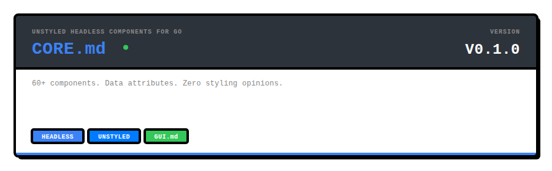
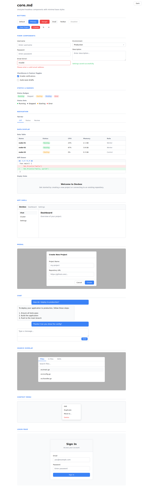

<p align="center">
  
</p>

<p align="center">
  Headless UI components for Go with minimal base styles, built on gui.md.
</p>

<p align="center">

```
go get github.com/readmedotmd/style.md/core.md
```

</p>

---

## What is core.md?

**core.md** provides 120+ UI components that render semantic HTML with `data-*` attributes for state. Components include just enough CSS for usability — no visual opinions.

Build your UI with core.md, then apply any theme on top with a single `<link>` tag.

```go
import (
    gui "github.com/readmedotmd/gui.md"
    coremd "github.com/readmedotmd/style.md/core.md"
)

func App() gui.Node {
    return coremd.Stack("lg",
        coremd.Heading(1, "", gui.Text("Dashboard")),
        coremd.HStack("md",
            coremd.Badge("", coremd.BadgeSuccess, "Online"),
            coremd.Muted("3 services running"),
        ),
        coremd.Card(coremd.CardProps{},
            coremd.DataTable("", []string{"Name", "Status"}, [][]gui.Node{
                {gui.Text("api"), coremd.StatusBadge("", coremd.StatusRunning, "Running")},
                {gui.Text("worker"), coremd.StatusBadge("", coremd.StatusPending, "Pending")},
            }),
        ),
        coremd.Button(coremd.ButtonProps{Variant: "primary"}, gui.Text("Deploy")),
    )
}
```

```html
<link rel="stylesheet" href="core.md/styles.css">
```

## Primitives

Layout and content primitives so your UI never needs external CSS.

### Layout

```go
// Vertical stack with medium gap
coremd.Stack("md", child1, child2, child3)

// Horizontal stack with spacer
coremd.HStack("md", left, coremd.Spacer(), right)

// 3-column grid
coremd.Grid(coremd.GridProps{Cols: "3"}, col1, col2, col3)

// Centered content
coremd.Center("", content)
```

```html
<!-- Or use data attributes directly in HTML -->
<div data-stack="md">...</div>
<div data-hstack="lg">...</div>
<div data-grid="3">...</div>
<div data-center>...</div>
```

Gap values: `xs` (4px), `sm` (8px), `md` (16px), `lg` (24px), `xl` (32px), `none` (0).

### Cards & Badges

```go
coremd.Card(coremd.CardProps{}, content)
coremd.Card(coremd.CardProps{Variant: "surface"}, content)

coremd.Badge("", coremd.BadgeAccent, "New")
coremd.Badge("", coremd.BadgeDanger, "Critical")
```

### Typography

```go
coremd.Heading(1, "", gui.Text("Title"))
coremd.Paragraph("", gui.Text("Body text."))
coremd.CodeBlock("", "fmt.Println(\"hello\")")
coremd.InlineCode("go build")
coremd.Muted("Secondary text")
coremd.Quote("", gui.Text("Important note."))
```

### Links, Images, Lists

```go
coremd.Link(coremd.LinkProps{Href: "/docs"}, gui.Text("Documentation"))
coremd.Image(coremd.ImageProps{Src: "photo.jpg", Alt: "Photo", Rounded: true})
coremd.Image(coremd.ImageProps{Src: "avatar.jpg", Avatar: true})

coremd.UnorderedList("",
    coremd.ListItem(gui.Text("First")),
    coremd.ListItem(gui.Text("Second")),
)
```

### Utilities

```go
coremd.Divider("")           // Horizontal rule
coremd.Truncate("", text)    // Ellipsis overflow
coremd.Mono("monospace")     // Monospace font
coremd.SrOnly("screen only") // Screen reader only
```

## Components

| Category        | Components | File |
|-----------------|------------|------|
| **Primitives**  | Stack, HStack, Grid, Center, Spacer, Card, Badge, Divider, Heading, Paragraph, CodeBlock, InlineCode, Link, Image, UnorderedList, OrderedList, Quote, Muted, Mono, Truncate, SrOnly | `primitives.go` |
| **Buttons**     | Button (primary, danger, toolbar; medium, small) | `button.go` |
| **Forms**       | FormGroup, TextInput, TextArea, SelectInput, Checkbox, FeatureRow, VariableRow, ErrorMessage, SuccessMessage | `form.go` |
| **Input**       | ChatInput, AutocompletePopup, MessageQueue, SearchInputField, PastePreview, ExpandButton, AttachButton, SendButton, CancelButton, ModeButton, MessageQueueBar, QueuedItem, AutocompleteHeader | `input.go` |
| **Display**     | MessageBubble, ThinkingIndicator, ThinkingCollapsible, ToolBadge, QuestionPrompt, StatusBadge, StatusDot, LabelBadge, UsageBadge, DiffViewer, DataTable, EmptyState, ClusterStatsBar, MessageContent, WorkingIndicator, ChatStatusBadge, ThinkingHistory, ChatError, AcceptPlanBar | `display.go` |
| **Lists**       | ConversationItem, InstanceCard, ServiceRow, RunnerRow, FileTree | `list.go` |
| **Navigation**  | NavLink, TabBar, BottomTabBar, ChatBackButton, HamburgerButton, ChatToolbar, ToolbarButton | `navigation.go` |
| **Overlay**     | SearchOverlay, ContextMenu, BottomSheet, SearchOverlayCard, SearchResult, SearchResultContent, SearchSnippet | `overlay.go` |
| **Panels**      | ServicesPanel, RunnerPanel, GitPanel, SkillsPanel, TerminalPanel, FileBrowser, GitSectionHeader, GitFileList, GitFile, GitCommitArea, DiffCommentButton, DiffInlineComment, ServiceActionButton, RunnerPanelEmpty | `panel.go` |
| **Layout**      | AppShell, Navbar, Sidebar, Panel, Modal, ModalBackdrop, DragHandle, DashboardLayout, SidebarColumn, SidebarOverlay, CenterColumn, ChatArea, ChatHeader, MessageList, ChatInputArea, ChatInputRow, ChatInputWrap | `layout.go` |
| **Pages**       | LoginPage, SetupWizard, DashboardPage, SettingsCard, SettingsPage, SettingsCardFull, SettingsSection, SettingsSubsection, SettingsForm, SettingsFormActions, SettingsFormHelp, SettingsCodeInput, SettingsEnvRow, SettingsFieldError, SettingsSchemaTable, AdminPage, ClusterPage, ClusterSummaryCard, ClusterSummaryRow | `page.go` |
| **Utility**     | Spinner, Icon, AppShellFull | `utility.go` |

## Data Attributes

Components use `data-*` attributes for state, which CSS themes can target:

| Attribute | Values | Used by |
|-----------|--------|---------|
| `data-variant` | `primary`, `danger`, `toolbar` | Button |
| `data-size` | `small`, `large` | Button, Spinner |
| `data-active` | `true` | NavLink, TabBar |
| `data-status` | `running`, `stopped`, `starting`, `pending`, `error` | StatusBadge, StatusDot |
| `data-stack` | `xs`, `sm`, `md`, `lg`, `xl` | Stack |
| `data-hstack` | `xs`, `sm`, `md`, `lg`, `xl` | HStack |
| `data-grid` | `1`-`6` | Grid |
| `data-card` | `true`, `surface`, `flush` | Card |
| `data-badge` | `true`, `accent`, `success`, `danger`, `warning` | Badge |
| `data-error` | `true` | TextInput |
| `data-streaming` | `true` | MessageBubble, ChatInput |
| `data-open` | `true` | Sidebar, SidebarColumn |
| `data-expanded` | `true` | Panel, ChatInputWrap, ExpandButton, GitPanel |
| `data-role` | `user`, `assistant` | MessageBubble, MessageContent |
| `data-mode` | `act`, `plan` | ModeButton |
| `data-has-image` | `true` | QueuedItem |
| `data-match` | `true` | SearchSnippet lines |
| `data-danger` | `true` | ContextMenu items, BottomSheet items, ToolbarButton |
| `data-staged` | `true` | GitSectionHeader, GitFile |
| `data-state` | `M`, `A`, `D`, `??` | GitFile |
| `data-selected` | `true` | AutocompletePopup items, GitFile |
| `data-variant` | `start`, `stop`, `restart` | ServiceActionButton |
| `data-diff` | `add`, `remove`, `header`, `context` | DiffViewer lines |
| `data-scrollable` | `true` | AppShellFull |
| `data-completed` | `true` | SetupWizard steps |

## CSS Custom Properties

Override these tokens to customize the base styles:

```css
:root {
  --core-font:       system-ui, sans-serif;
  --core-font-mono:  ui-monospace, monospace;
  --core-text:       #1a1a1a;
  --core-text-muted: #6b7280;
  --core-bg:         #ffffff;
  --core-surface:    #f9fafb;
  --core-border:     #d1d5db;
  --core-accent:     #3b82f6;
  --core-danger:     #ef4444;
  --core-success:    #22c55e;
  --core-warning:    #f59e0b;
  --core-info:       #3b82f6;
  --core-radius:     6px;
  --core-space:      8px;
  --core-transition: 150ms ease;
}
```

Dark mode: `prefers-color-scheme: dark` or `data-theme="dark"` on `<html>`.

## Theming

core.md is designed to be themed. A theme is a CSS file that overrides `--core-*` properties and adds styles to `data-*` selectors:

```html
<link rel="stylesheet" href="core.md/styles.css">
<link rel="stylesheet" href="industrial.md/theme.css">
```

See [industrial.md](../industrial.md) for a complete theme example.

## Showcase

<p align="center">
  
</p>

---

<p align="center">
  <strong>core.md</strong> is part of the <a href="https://github.com/readmedotmd">readme.md</a> project.
</p>
