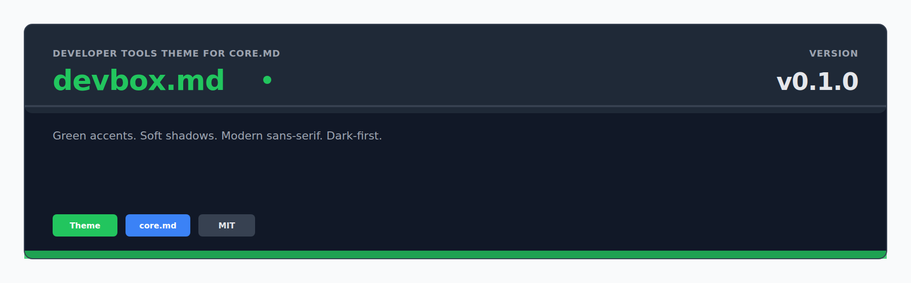
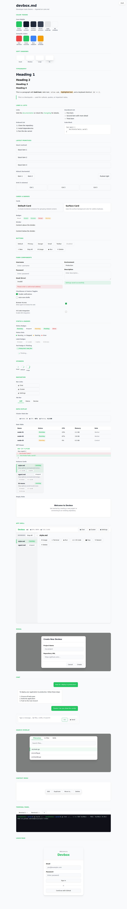

<p align="center">
  
</p>

<p align="center">
  Developer tools theme for core.md — Inter typography, green accents, soft shadows, dark-first.
</p>

<p align="center">

```
go get github.com/readmedotmd/style.md/devbox.md
```

</p>

---

## What is devbox.md?

**devbox.md** is a theme for [core.md](../core.md) components. It applies a modern developer-tools design language: Inter sans-serif typography, `#22C55E` green accents, soft rounded corners, subtle layered shadows, and a dark-first aesthetic inspired by the Devbox app.

**Two ways to use it:**

### 1. CSS-only (recommended for flexibility)

Use core.md Go components and add Devbox styling with a single CSS file:

```html
<link rel="stylesheet" href="core.md/styles.css">
<link rel="stylesheet" href="devbox.md/theme.css">
```

```go
import coremd "github.com/readmedotmd/style.md/core.md"

// Same Go code — the theme is applied purely through CSS
btn := coremd.Button(coremd.ButtonProps{Variant: "primary"}, gui.Text("Deploy"))
```

### 2. Go wrappers (for BEM class integration)

Import devbox.md directly for components pre-styled with BEM class names:

```go
import devboxmd "github.com/readmedotmd/style.md/devbox.md"

btn := devboxmd.Button(devboxmd.ButtonProps{
    Variant: devboxmd.ButtonPrimary,
}, gui.Text("Deploy"))
```

Include `styles.css` for BEM-class styles, or `theme.css` for data-attribute styles.

## Design Language

| Element | Treatment |
|---------|-----------|
| **Typography** | Inter sans-serif, -0.01em tracking, 700 headings, clean hierarchy |
| **Accent** | `#22C55E` green, used for brand, primary actions, and active states |
| **Borders** | 1px solid, subtle (`#E5E7EB` light / `#374151` dark) |
| **Shadows** | Layered soft shadows (`0 4px 6px -1px`), no hard offsets |
| **Buttons** | Medium weight, soft rounded (6px), subtle shadow on hover |
| **Cards** | 1px borders, 8px radius, shadow lift on hover |
| **Badges** | Pill-shaped (9999px radius), no borders, tinted backgrounds |
| **Lists** | Disc bullet points |
| **Links** | No underline by default, underline on hover, green color |
| **Blockquotes** | 3px green left border, muted text |
| **Tables** | Surface header, 600 weight column names |
| **Dividers** | 1px solid, minimal |
| **Active state** | Left green border + green-tinted background |
| **Status dots** | Glowing green for running, pulse animation for starting |

## Theme Tokens

devbox.md overrides all `--core-*` CSS properties and adds its own:

```css
:root {
  --core-font: 'Inter', system-ui, sans-serif;
  --core-font-mono: 'JetBrains Mono', ui-monospace, monospace;
  --core-accent: #22C55E;
  --core-border: #E5E7EB;
  --core-radius: 8px;

  --dbx-sidebar-bg: #F3F4F6;
  --dbx-active-bg: rgba(34, 197, 94, 0.08);
  --dbx-active-border: #22C55E;
  --dbx-shadow-sm: 0 1px 2px rgba(0, 0, 0, 0.05);
  --dbx-shadow-md: 0 4px 6px -1px rgba(0, 0, 0, 0.07), ...;
  --dbx-shadow-lg: 0 10px 15px -3px rgba(0, 0, 0, 0.08), ...;
}
```

## Components

All core.md components are re-exported with identical APIs:

| Category | Components |
|----------|------------|
| **Primitives** | Stack, HStack, Grid, Center, Spacer, Card, Badge, Divider, Heading, Paragraph, CodeBlock, InlineCode, Link, Image, UnorderedList, OrderedList, Quote, Muted, Mono, Truncate, SrOnly |
| **Buttons** | Button |
| **Forms** | FormGroup, TextInput, TextArea, SelectInput, Checkbox, FeatureRow, VariableRow, ErrorMessage, SuccessMessage |
| **Display** | MessageBubble, ThinkingIndicator, StatusBadge, StatusDot, DiffViewer, DataTable, EmptyState |
| **Layout** | AppShell, Navbar, Sidebar, Panel, Modal |
| **Navigation** | NavLink, TabBar, BottomTabBar |
| **Utility** | Spinner, Icon |

Plus 260+ exported CSS class constants in `tokens.go` for building custom components that stay on-system.

## Files

```
devbox.md/
├── theme.css          CSS-only theme (targets data-* selectors)
├── styles.css         BEM class-based stylesheet (for Go wrappers)
├── tokens.go          260+ CSS class constants
├── primitives.go      Layout, card, badge, typography, image, list wrappers
├── button.go          Themed button
├── form.go            Themed form components
├── display.go         Themed display components
├── layout.go          Themed layout components
├── ...                (14 Go files total)
└── examples/
    └── showcase.html  Interactive component showcase
```

## Showcase

<p align="center">
  
</p>

---

<p align="center">
  <strong>devbox.md</strong> is part of the <a href="https://github.com/readmedotmd">readme.md</a> project.
</p>
