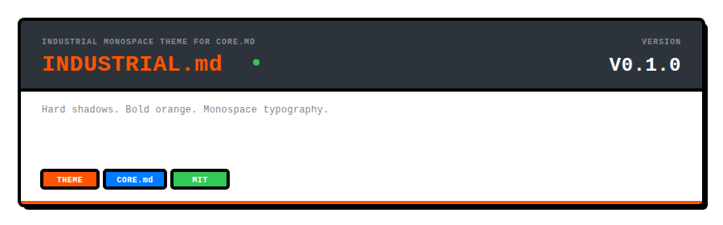
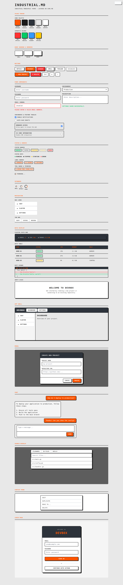

<p align="center">
  
</p>

<p align="center">
  Industrial monospace theme for core.md — Space Mono, hard shadows, bold accents.
</p>

<p align="center">

```
go get github.com/readmedotmd/style.md/industrial.md
```

</p>

---

## What is industrial.md?

**industrial.md** is a theme for [core.md](../core.md) components. It applies an industrial monospace design language: Space Mono typography, `#FF5500` orange accents, hard shadows, 2px borders, uppercase labels, and full dark mode.

**Two ways to use it:**

### 1. CSS-only (recommended for flexibility)

Use core.md Go components and add industrial styling with a single CSS file:

```html
<link rel="stylesheet" href="core.md/styles.css">
<link rel="stylesheet" href="industrial.md/theme.css">
```

```go
import coremd "github.com/readmedotmd/style.md/core.md"

// Same Go code — the theme is applied purely through CSS
btn := coremd.Button(coremd.ButtonProps{Variant: "primary"}, gui.Text("Deploy"))
```

### 2. Go wrappers (for BEM class integration)

Import industrial.md directly for components pre-styled with BEM class names:

```go
import industrialmd "github.com/readmedotmd/style.md/industrial.md"

btn := industrialmd.Button(industrialmd.ButtonProps{
    Variant: industrialmd.ButtonPrimary,
}, gui.Text("Deploy"))
```

Include `styles.css` for BEM-class styles, or `theme.css` for data-attribute styles.

## Design Language

| Element | Treatment |
|---------|-----------|
| **Typography** | Space Mono monospace, uppercase headings, 0.04em letter-spacing |
| **Accent** | `#FF5500` orange, used for primary actions and highlights |
| **Borders** | 2px solid, high contrast (`#1A1A1A` light / `#444444` dark) |
| **Shadows** | Hard offset shadows (`3px 3px 0`), no blur |
| **Buttons** | Uppercase, bold, hard shadows with press animation |
| **Cards** | 2px borders with hard shadow on hover |
| **Badges** | Rectangular (3px radius), uppercase, bordered |
| **Lists** | Square bullet points |
| **Links** | Underlined, bold, thicker on hover |
| **Blockquotes** | 4px orange left border, uppercase |
| **Tables** | Dark header bar with orange column names |
| **Dividers** | 2px solid rules |

## Theme Tokens

industrial.md overrides all `--core-*` CSS properties and adds its own:

```css
:root {
  --core-font: 'Space Mono', monospace;
  --core-accent: #FF5500;
  --core-border: #1A1A1A;
  --core-radius: 4px;

  --ind-dark: #2D333B;
  --ind-shadow-sm: 3px 3px 0 var(--core-border);
  --ind-shadow-md: 4px 4px 0 var(--core-border);
  --ind-shadow-lg: 6px 6px 0 var(--core-border);
}
```

## Components

All core.md components are re-exported with identical APIs:

| Category | Components |
|----------|------------|
| **Primitives** | Stack, HStack, Grid, Center, Spacer, Card, Badge, Divider, Heading, Paragraph, CodeBlock, InlineCode, Link, Image, UnorderedList, OrderedList, Quote, Muted, Mono, Truncate, SrOnly |
| **Buttons** | Button |
| **Forms** | FormGroup, TextInput, TextArea, SelectInput, Checkbox, FeatureRow, VariableRow, ErrorMessage, SuccessMessage |
| **Display** | MessageBubble, ThinkingIndicator, StatusBadge, StatusDot, DiffViewer, DataTable, EmptyState |
| **Layout** | AppShell, Navbar, Sidebar, Panel, Modal |
| **Navigation** | NavLink, TabBar, BottomTabBar |
| **Utility** | Spinner, Icon |

Plus 260+ exported CSS class constants in `tokens.go` for building custom components that stay on-system.

## Files

```
industrial.md/
├── theme.css          CSS-only theme (targets data-* selectors)
├── styles.css         BEM class-based stylesheet (for Go wrappers)
├── tokens.go          260+ CSS class constants
├── primitives.go      Layout, card, badge, typography, image, list wrappers
├── button.go          Themed button
├── form.go            Themed form components
├── display.go         Themed display components
├── layout.go          Themed layout components
├── ...                (14 Go files total)
└── examples/
    └── showcase.html  Interactive component showcase
```

## Showcase

<p align="center">
  
</p>

---

<p align="center">
  <strong>industrial.md</strong> is part of the <a href="https://github.com/readmedotmd">readme.md</a> project.
</p>
